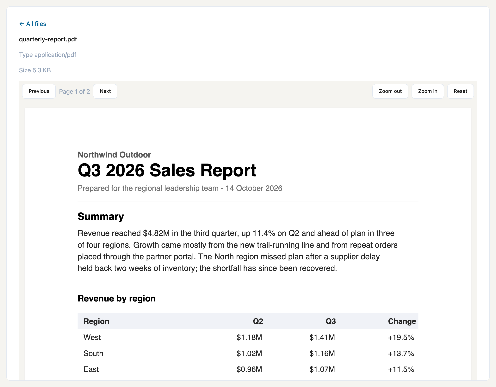

# Osysharp.Pdf — read PDFs inside your app

Two controls over a stored PDF: `PdfViewer`, a paged reader with fit, zoom and a real text layer, and `PdfThumbnail`,
which draws one page as a picture for a list or a card. Rendering is pdf.js, in the browser.

## Use case

Any app that keeps documents people need to look at without downloading them: contracts awaiting a signature, invoices
in an approval queue, reports shared with a team, scanned forms attached to a case. Upload the file as a `FileAsset` and
show it on the page it belongs to — the text stays selectable and readable by a screen reader, scanned pages render
too, and a file list can show each document's first page instead of a generic icon.



## Install

```osy
// app.osy
app Contracts {
  use Osysharp.Pdf@1;
  model "model/**/*.osy";
}
```

```console
osy lock      # resolves the package and pins its content address in osyrin.lock
```

## Using it

```osy
using Osysharp.Pdf;

[Page("/documents/{id}")]
component DocumentPage(Guid id) {
  int shown = 1;
  int pages = 0;
  action Loaded(int count) { pages = count; }
  action Moved(int page) { shown = page; }

  render {
    PdfViewer(fileAsset: id, page: shown, fit: "width", loaded: Loaded, pageChanged: Moved) {
      slot Toolbar { v =>
        Row(gap: 1) {
          Button("Previous", onClick: v.PreviousPage);
          Text("Page " + shown + " of " + pages);
          Button("Next", onClick: v.NextPage);
        }
      }
    }
  }
}
```

The document is read through the app's own file access: the viewer asks for a signed address to the asset under the
viewer's own permissions, so a person who may not read the file cannot open it here either.

| `PdfViewer` prop | default | what it does |
|---|---|---|
| `fileAsset` | — | the stored PDF to show |
| `page` | `1` | the page in view |
| `fit` | `"width"` | `width`, `page` or `actual` |
| `zoom` | `100` | percent, on top of the fit |
| `layout` | `"continuous"` | `continuous` scrolls through every page; `single` shows one |

It raises `loaded(pageCount)`, `pageChanged(page)` and `failed(reason)`, and takes the commands `NextPage`,
`PreviousPage`, `ZoomIn`, `ZoomOut` and `ResetZoom` — which is how the `Toolbar` slot above drives it.

`PdfThumbnail(fileAsset: id, page: 1, width: 128)` draws one page as a picture and raises `loaded` and `failed`.
Both controls share the same chunks, so a list of thumbnails and the reader download pdf.js once.

## Build your own on top

**Make the reader yours without forking.** The toolbar is your markup in the `Toolbar` slot, so paging, zoom, a
download button or a "sign this document" action are ordinary app code next to the viewer. A component of yours can
wrap the pair — a `DocumentPreview` that shows a thumbnail and opens the reader — and your pages use that.

**Fork it.** Fork this repository into your own GitHub account or organisation and rename the package to match —
`package Acme.Pdf` lives at `github.com/acme/pdf`, because a package's owner *is* its GitHub owner. The controls are
a TypeScript shim over pdf.js, built with the ordinary CLI:

```console
npm install
npm run chunks          # rebuild pdfjs-core.js, pdfjs-worker.js, fonts/ and wasm/ from the installed pdf.js
osy control build .     # regenerate the typed ABI, type-check the shim against it, bundle it, re-pin osyrin.lock
osy publish             # check the package and create the release
```

`pdf.control.check.ts` is generated from the declaration so `tsc` proves the shim uses only the public control ABI —
the same one your own controls get.

⚠ **`cmaps/` is deliberately not built.** It is 1.6 MB of CJK encoding tables, needed only by a document with CJK
text in a non-Unicode encoding. A fork that needs it adds one entry in `scripts/build-chunks.mjs` and one in the `chunks { }` block.

### What is in the source

| file | what it is |
|---|---|
| `pdf.osy` | the `control PdfViewer` declaration — the kit's whole public surface |
| `pdf.ts` | the shim source: chunk loading, signing, page layout, canvas + text layer |
| `pdf.js` | the bundled shim, checked in — what a consumer's browser loads |
| `pdfjs-core.js` / `pdfjs-worker.js` | the `Core` and `Worker` chunks. ⚠ named `pdfjs-*` and not `pdf.js`, which is the SHIM's name — copying the library in under its upstream name would overwrite the shim with the library, and the kit would still build and pin |
| `fonts/` | the `Fonts` package chunk — the base-14 substitutes, for a document that embeds none |
| `wasm/` | the `Wasm` package chunk — JBIG2 / JPEG 2000 decoders. Not optional in practice: a scan renders BLANK without them, because pdfjs falls back silently |
| `licenses/` | the upstream licence texts. Shipped with the source rather than served to a browser |
| `osyrin.lock` | the package's pins — the bundle and its chunks by content address |
| `pdf.control.d.ts` / `.check.ts` | GENERATED by `osy control build` — the ABI, and the line that holds the shim to it |

## Licence

MIT &mdash; see [`LICENSE`](LICENSE). The `.osy` source is yours to read, copy, fork and ship.

pdf.js is Apache-2.0. It, the fonts and the decoders the kit ships keep their own terms; those texts are in
`licenses/` and [`LICENSE`](LICENSE) names each one.
